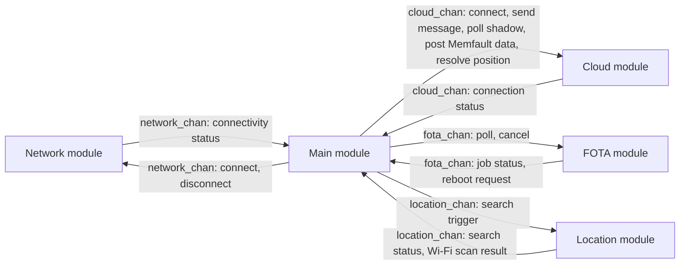
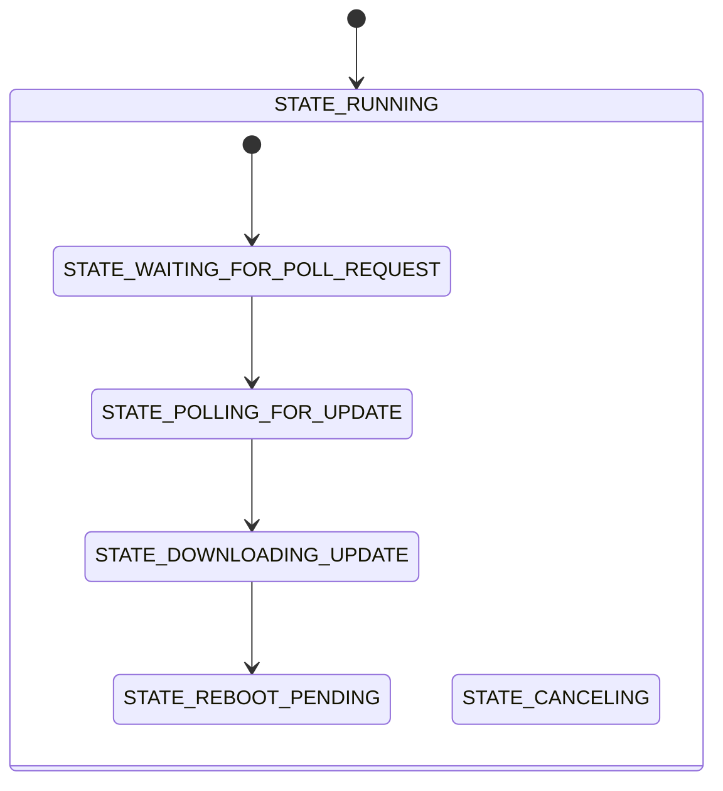

# Architecture

The [91m1_ppp](../) application is built on a modular, event-driven architecture. The modules interact through messages that are processed as events by the modules' state machines.

The architecture is implemented using [Zephyr bus (zbus)](https://docs.nordicsemi.com/bundle/ncs-latest/page/zephyr/services/zbus/index.html) for inter-module communication and the [State Machine Framework](https://docs.nordicsemi.com/bundle/ncs-latest/page/zephyr/services/smf/index.html) (SMF) for managing module behavior.

This document provides an overview of the architecture, with a focus on the zbus message passing and the modules' state machines. For the runtime behavior of the application as a whole, see [Application behavior](application-behavior.md).

## System overview

The application runs on the host MCU (nRF54L15 or nRF54LM20B) and uses the nRF91M1 Serial Modem as a cellular data interface over PPP. It consists of the following modules:

- **[Main module](modules/main.md)**: Implements the business logic and controls the overall application behavior. Uniquely, it is not in the `modules` folder.
- **[Network module](modules/network.md)**: Brings the PPP link to the Serial Modem up and down, and tracks connectivity status.
- **[Cloud module](modules/cloud.md)**: Handles communication with nRF Cloud using CoAP.
- **[FOTA module](modules/fota.md)**: Manages firmware over-the-air updates of the host application.
- **[Location module](modules/location.md)**: Provides Wi-Fi based positioning. Only built with the location overlay.

The following diagram shows how the modules interact. Each module owns one channel, and both the requests sent to a module and the notifications it publishes go on that channel. All communication passes through the Main module, which is the only module that knows about the others.



The following steps show the simplified flow of a typical operation:

1. The Network module connects on startup, and publishes `NETWORK_CONNECTED` on the `network_chan` channel once the PPP link carries IP traffic.
1. The Main module responds by requesting a cloud connection with `CLOUD_CONNECT` on the `cloud_chan` channel. The Cloud module waits for valid time and installed credentials, connects to nRF Cloud, and publishes `CLOUD_CONNECTED`.
1. While the cloud connection is up, the Main module runs a periodic **cloud synchronization**: it sends a device message, triggers a location search, polls the device shadow, requests a FOTA poll, and posts pending Memfault data.
1. A location search runs asynchronously. The Location module scans for Wi-Fi access points and publishes the result as `LOCATION_CLOUD_REQUEST`, which the Main module forwards to the Cloud module for resolution by the nRF Cloud location service.
1. If the FOTA poll finds a job, the FOTA module downloads the update and asks the Main module to reboot with `FOTA_REBOOT_REQUEST`.

## Module design

Each module follows a similar design:

- **Message channel**: Each module defines its own zbus channel. A single channel is used for all messages that are specific to a module.
- **Message types**: Each module exposes a set of input and output message types. These can be considered events in the state machine sense and might have associated data.
- **State machine**: Each module implements a state machine using SMF to manage its internal state and behavior.
- **Thread**: Each module has its own thread, so that blocking calls in one module cannot stall another.
- **Watchdog**: Each module thread is monitored by a task watchdog. Each thread periodically calls `task_wdt_feed()`. If a thread fails to feed its watchdog within its configured timeout, the system resets.
- **Initialization**: Modules are initialized in their dedicated thread, which is started with `K_THREAD_DEFINE()`.

The modules are designed as loosely coupled units with well-defined message-based interfaces. They communicate exclusively through their zbus channels, without reference to other modules' internals. This means each module can be developed, tested, and maintained independently, and every module except the Main module can be reused in other applications.

Modules often handle state transitions based on messages they themselves publish. For example, when the Network module publishes a `NETWORK_CONNECTED` message, it also receives this message in its own state machine, allowing it to transition to the connected state with consistent handling.

The Main module deviates from the pattern in two ways: it runs in the `main()` thread instead of a thread of its own, and it is the only module that calls `task_wdt_init()` to set up the hardware watchdog (`DT_ALIAS(watchdog0)`) that all the other modules add their tasks to.

### Module threads

Each module's thread follows the same pattern of waiting for new messages and handling them by executing a state machine. For example, a simplified version of the Network module's thread looks like this:

```c
static void network_module(void)
{
	int err;
	int task_wdt_id;
	const uint32_t wdt_timeout_ms =
		(CONFIG_APP_NETWORK_WATCHDOG_TIMEOUT_SECONDS * MSEC_PER_SEC);
	const uint32_t execution_time_ms =
		(CONFIG_APP_NETWORK_MSG_PROCESSING_TIMEOUT_SECONDS * MSEC_PER_SEC);
	const k_timeout_t zbus_wait = K_MSEC(wdt_timeout_ms - execution_time_ms);

	task_wdt_id = task_wdt_add(wdt_timeout_ms, network_wdt_callback, (void *)k_current_get());

	/* Initialize the state machine to the initial state */
	smf_set_initial(SMF_CTX(&network_state), &states[STATE_DISCONNECTED]);

	while (true) {
		/* Feed the watchdog before blocking on the next message */
		err = task_wdt_feed(task_wdt_id);

		/* Wait for a message on any subscribed channel */
		err = zbus_sub_wait_msg(&network, &network_state.chan,
					network_state.msg_buf, zbus_wait);
		if (err == -ENOMSG) {
			continue;
		} else if (err) {
			LOG_ERR("zbus_sub_wait_msg, error: %d", err);
			FATAL_ERROR();
		}

		/* Run the state machine with the received message */
		err = smf_run_state(SMF_CTX(&network_state));
		if (err) {
			LOG_ERR("smf_run_state(), error: %d", err);
			FATAL_ERROR();
		}
	}
}
```

In this pattern:

1. The thread feeds its task watchdog, then waits for a message using `zbus_sub_wait_msg()`.
1. When a message arrives, it is stored in the state object's buffer along with the channel it was received on.
1. The state machine is then executed with `smf_run_state()`, which calls the appropriate handler for the current state.
1. The handler processes the message based on its type and the current state, potentially triggering state transitions.
1. The loop continues, waiting for the next message.

The wait is bounded rather than `K_FOREVER` so that the watchdog is fed even when no messages arrive. The timeout is the watchdog timeout minus the time budgeted for processing a single message, which leaves room for the longest possible message handling before the watchdog expires. A timeout returns `-ENOMSG`, which simply restarts the loop.

### Watchdog timeouts

Each module configures its own watchdog timeout and message processing budget, sized after the longest operation the module performs while handling a message:

| Module | Watchdog timeout | Message processing budget |
|--------|-----------------:|--------------------------:|
| Main | 120 s | 110 s |
| Network | 120 s | 110 s |
| Cloud | 300 s | 290 s |
| FOTA | 900 s | 870 s |
| Location | 120 s | 60 s |

The FOTA module has the longest timeout because a firmware download runs to completion inside a single message handler. The Cloud module needs a long timeout because connecting waits for valid time and performs a DTLS handshake.

## Message passing with zbus

The zbus library is part of Zephyr and implements channel-based message passing between threads. This section covers how zbus is used in this application. See the [zbus documentation](https://docs.nordicsemi.com/bundle/ncs-latest/page/zephyr/services/zbus/index.html) for an introduction to zbus.

### Channels

Each module declares and defines a channel using zbus macros. For example, in the `src/modules/network/network.h` file, the Network module declares the `network_chan` channel:

```c
ZBUS_CHAN_DECLARE(network_chan);
```

The channel is defined in `src/modules/network/network.c`:

```c
ZBUS_CHAN_DEFINE(network_chan,          /* Channel name, derived from module name */
		 struct network_msg,    /* Message data type */
		 NULL,                  /* Optional validator function */
		 NULL,                  /* Optional pointer to user data */
		 ZBUS_OBSERVERS_EMPTY,  /* Initial observers */
		 ZBUS_MSG_INIT(.type = NETWORK_DISCONNECTED)); /* Message initialization */
```

The fields of the `ZBUS_CHAN_DEFINE` macro are populated in a similar way across modules:

- **Channel name**: The name of the channel, derived from the module name.
- **Message data type**: The data type used to hold message data. The name comes from the channel name.
- **Validator function** and **User data**: Not used.
- **Initial observers**: The initial observer list is empty. Observers are added in the relevant modules later.
- **Message initialization**: The initial value stored in the channel. Not used, and therefore set either to the module's disconnected message type or to `ZBUS_MSG_INIT(0)`.

> [!IMPORTANT]
> In the context of zbus, you can use the term "message type" to refer to the data type or structure containing the message data for a given channel, in this case `struct network_msg`. In this architecture, "message type" is used to mean the enumerated value that distinguishes different kinds of messages sent on the same channel, in this case the `type` field of `struct network_msg`.

### Message types and the message structure

Each module exposes a set of message types through an enumeration. The message types can be considered events in the state machine sense. The message type is typically used within a switch-case statement by the subscriber to determine what actions to take and whether to trigger a state transition.

The message types can be divided into two categories:

- **Input message types**: Commands or requests sent by other modules to the defining module to trigger actions (for example, `CLOUD_CONNECT` to request the Cloud module to connect to nRF Cloud).
- **Output message types**: Responses or notifications sent by the defining module to other modules to report status, data, or events (for example, `CLOUD_CONNECTED` when the cloud connection has been established).

Each module's message types are defined in its public header file located at `src/modules/<module_name>/<module_name>.h`. For example, the Cloud module's messages are defined in `src/modules/cloud/cloud.h` in the `enum cloud_msg_type` enumeration:

```c
enum cloud_msg_type {
	/* Output message types */

	/* The cloud connection is down. */
	CLOUD_DISCONNECTED = 0x1,
	/* The cloud connection is established. */
	CLOUD_CONNECTED,
	/* The device shadow has been polled. */
	CLOUD_SHADOW_POLLED,

	/* Input message types */

	/* Request to establish the cloud connection. */
	CLOUD_CONNECT,

	/* ... */
};
```

The message type forms the first part of the message structure. For some message types, associated data is present in the message, and the message type determines which fields are valid. For optional features, `#if defined()` guards are used to include the fields only when the feature is enabled:

```c
struct cloud_msg {
	enum cloud_msg_type type;
	char payload[CONFIG_APP_CLOUD_MSG_MAX_LEN];
	size_t payload_len;
#if defined(CONFIG_APP_LOCATION)
	/** Valid for @ref CLOUD_LOCATION_REQUEST messages. */
	struct location_cloud_request_data location_request;
#endif /* CONFIG_APP_LOCATION */
};
```

In the above example, the Cloud module receiving a `CLOUD_LOCATION_REQUEST` message reads the scanned Wi-Fi access points from the `location_request` field of the message.

### Sending messages

Messages are sent on a channel using `zbus_chan_pub()`. For example, to request a cloud disconnect on the `cloud_chan` channel:

```c
	struct cloud_msg msg = {
		.type = CLOUD_DISCONNECT
	};

	err = zbus_chan_pub(&cloud_chan, &msg, PUB_TIMEOUT);
```

Zbus copies the message, so the original message struct is no longer needed after calling `zbus_chan_pub()`. `PUB_TIMEOUT` is a common publish timeout defined in `lib/include/app_common.h`.

### Receiving messages

In zbus, structures called _observers_ are used to receive messages on one or more zbus channels. There are multiple types of observers. All modules in this application use **message subscribers**, which receive messages asynchronously in the module's own thread.

A message subscriber queues up messages that are received while the module is busy processing another message. The module then processes the messages in the order they were received. An incoming message can never interrupt the processing of another message.

A message subscriber is defined using `ZBUS_MSG_SUBSCRIBER_DEFINE`, and the subscriber is added to a channel using `ZBUS_CHAN_ADD_OBS`. For example, in the Network module:

```c
ZBUS_MSG_SUBSCRIBER_DEFINE(network);
ZBUS_CHAN_ADD_OBS(network_chan, network, 0);
```

The messages are received in the module's thread loop by calling `zbus_sub_wait_msg()`:

```c
err = zbus_sub_wait_msg(&network, &network_state.chan,
			network_state.msg_buf, zbus_wait);
```

The channel and the message contents are stored in the module's [state object](#state-object) in preparation to run the state handler, where the message will be processed.

In modules that subscribe to multiple channels, a channel list macro is used to simplify subscribing to all the channels. The same macro is used to determine the size of a message buffer to handle the largest possible message. For example, in `src/main.c`:

```c
#define CHANNEL_LIST(X) \
	X(network_chan, struct network_msg) \
	X(cloud_chan, struct cloud_msg) \
	IF_ENABLED(CONFIG_APP_FOTA, (X(fota_chan, struct fota_msg))) \
	IF_ENABLED(CONFIG_APP_LOCATION, (X(location_chan, struct location_msg))) \
	X(main_priv_chan, struct priv_main_msg)

/* Calculate the maximum message size from the list of channels */
#define MAX_MSG_SIZE		    MAX_MSG_SIZE_FROM_LIST(CHANNEL_LIST)

/* Add main_subscriber as observer to all the channels in the list. */
#define ADD_OBSERVERS(_chan, _type) ZBUS_CHAN_ADD_OBS(_chan, main_subscriber, 0);

CHANNEL_LIST(ADD_OBSERVERS)
```

### Private channels

When a module needs internal state handling that should not be exposed to other modules, it uses a **private channel**. Private channels are reserved exclusively for the respective module and are not intended for external use. Otherwise, they are defined, published to, and subscribed to just like public channels. Three modules use one:

- The Cloud module uses `priv_cloud_chan` to turn every attempt at connecting into a message, so that it can retry without blocking its state machine.
- The FOTA module uses `priv_fota_chan` to move the nRF Cloud FOTA library callbacks, which run in the library's own context, into the module's state machine.
- The Main module uses `main_priv_chan` to move the periodic cloud synchronization from the workqueue that runs the timer into its state machine.

Private channels are defined in the module's `.c` file and are never declared in a public header, so no other module can publish to them.

## State machines

The State Machine Framework (SMF) is a Zephyr library that provides a way to implement hierarchical state machines in a structured manner. In a hierarchical state machine, you can implement behavior common to multiple states in a shared parent state. The Main, FOTA, and Location modules use hierarchical state machines, while the Network and Cloud modules are simple enough to use flat ones.

The state machines follow a run-to-completion model where:

- Message processing and state machine execution, including transitions, are completed before processing any new messages.
- Entry and exit functions are called in the correct order when transitioning states.
- Parent state transitions are handled automatically when transitioning between child states.

This model ensures predictable behavior and proper state cleanup during transitions, as there is no mechanism for interrupting or changing the state machine execution from the outside.

This section covers how SMF is used in the modules. See the [SMF documentation](https://docs.nordicsemi.com/bundle/ncs-latest/page/zephyr/services/smf/index.html) for an introduction to SMF.

### State machine definition

SMF supports defining a hierarchy of states. For example, the FOTA module's states can be graphically described as follows:



In the diagram, the black dots with arrows indicate initial transitions. In this case, the initial state of the machine is set to the top-level `STATE_RUNNING` state. In the state definitions, an initial transition is configured such that the state machine ends up in `STATE_WAITING_FOR_POLL_REQUEST` when first initialized. See [FOTA module](modules/fota.md) for the complete set of transitions.

In SMF, a single state is defined using the `SMF_CREATE_STATE` macro. You can specify the following parameters:

- **Entry function:** Called when entering the state.
- **Run function:** Called when processing a message while in the state.
- **Exit function:** Called when leaving the state.
- **Parent state:** Another state to which this state is subordinate.
- **Initial state transition:** Another state to transition to immediately after entry.

The following shows the definitions of two of the states in the FOTA module from `src/modules/fota/fota.c`, with the parent state and initial transition as shown in the diagram:

```c
static const struct smf_state states[] = {
	[STATE_RUNNING] =
		SMF_CREATE_STATE(state_running_entry,
				 state_running_run,
				 NULL,				/* No exit function */
				 NULL,				/* No parent state */
				 &states[STATE_WAITING_FOR_POLL_REQUEST]),
	[STATE_WAITING_FOR_POLL_REQUEST] =
		SMF_CREATE_STATE(NULL,				/* No entry function */
				 state_waiting_for_poll_request_run,
				 NULL,				/* No exit function */
				 &states[STATE_RUNNING],
				 NULL),				/* No initial transition */
	/* ... */
};
```

### State object

SMF uses a data structure of type `struct smf_ctx` to track the current state of the state machine. This structure is embedded within a larger structure called the _state object_ that holds the following:

- SMF's context structure.
- The zbus channel of the latest message received.
- The contents of the latest message received.
- Any extended state variables needed by the module.

For example, the FOTA module defines its state object structure:

```c
struct fota_state_object {
	/* This must be first */
	struct smf_ctx ctx;

	/* Last channel type that a message was received on */
	const struct zbus_channel *chan;

	/* Buffer for last zbus message */
	uint8_t msg_buf[MAX_MSG_SIZE];

	/* Extended state variable: nRF Cloud FOTA poll context */
	struct nrf_cloud_fota_poll_ctx fota_ctx;
};
```

The structure is allocated in the module's thread and passed to all SMF functions.

### State machine initialization

State machines are initialized to an initial state using `smf_set_initial()`:

```c
smf_set_initial(SMF_CTX(&fota_state), &states[STATE_RUNNING]);
```

This has to be done before the state machine is executed for the first time. Entry functions of the initial state, and of any state reached through initial transitions, run at this point. This is where modules that need it perform their initialization, such as the FOTA module initializing the nRF Cloud FOTA poll library in `state_running_entry()`.

### Run functions

The run function for each state handles incoming messages and follows a similar pattern:

- The incoming message is identified by its channel and message type.
- If the module should handle the message in its current state, any relevant actions are performed.
- To enforce the run-to-completion model, control flow must end in one of three ways:

    - `return SMF_EVENT_HANDLED;` to end the message handling without transitioning to a new state.
    - `smf_set_state()` followed directly by `return SMF_EVENT_HANDLED;` to end the message handling and trigger a state transition.
    - `return SMF_EVENT_PROPAGATE;` to signal that the message was **not** handled in the current state.

> [!IMPORTANT]
> In SMF, the run function of the current state is executed first, and then the run function of the parent state is executed, unless the child state returns `SMF_EVENT_HANDLED` to indicate that the event has been handled.

The FOTA module shows why this matters: `FOTA_DOWNLOAD_CANCEL` is handled once in the parent `STATE_RUNNING`, so a cancel request is honored from any substate that does not handle it itself.

### State transitions

Transitions between states are handled using `smf_set_state()`:

```c
smf_set_state(SMF_CTX(state_object), &states[NEW_STATE]);
```

A transition to another state must be the last thing happening in a state handler. This is to ensure the correct order of execution of parent state handlers. SMF automatically handles the execution of exit and entry functions for all states along the path to the new state.

### State machine execution

The state machine is run using `smf_run_state()`. SMF executes the run function defined for the current state, and then:

- If the run function returns `SMF_EVENT_PROPAGATE`, the process is repeated for the parent state, if there is one.
- If the run function triggers a state transition, SMF runs any relevant exit and entry functions.

`smf_run_state()` is run from the module threads to process incoming messages, as described in [Module threads](#module-threads).
