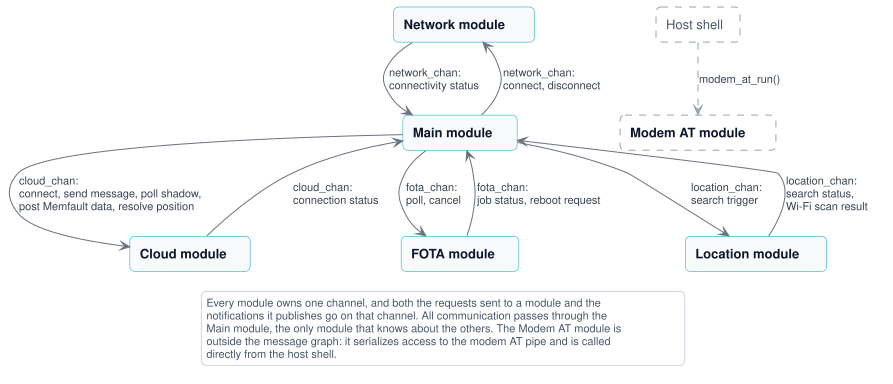

# Architecture

The modules of the [91m1_ppp](../) application, how they interact, and the state machines they run. The zbus and SMF patterns behind all of this are shared with the other applications and described in [Architecture](../../../doc/architecture.md). For the runtime behavior of the application as a whole, see [Application behavior](application-behavior.md).

## System overview

The application runs on the host MCU (nRF54L15 or nRF54LM20B) and uses the nRF91M1 Serial Modem as a cellular data interface over PPP. It consists of the following modules:

- **[Main module](modules/main.md)**: Implements the business logic and controls the overall application behavior. Uniquely, it is not in the `modules` folder.
- **[Network module](modules/network.md)**: Brings the PPP link to the Serial Modem up and down, and tracks connectivity status.
- **[Cloud module](modules/cloud.md)**: Handles communication with nRF Cloud using CoAP.
- **[FOTA module](modules/fota.md)**: Manages firmware over-the-air updates of the host application.
- **[Location module](modules/location.md)**: Provides Wi-Fi based positioning. Only built with the location overlay.

The following diagram shows how the modules interact. Each module owns one channel, and both the requests sent to a module and the notifications it publishes go on that channel. All communication passes through the Main module, which is the only module that knows about the others.

The following steps show the simplified flow of a typical operation:

1. The Network module connects on startup, and publishes `NETWORK_CONNECTED` on the `network_chan` channel once the PPP link carries IP traffic.
1. The Main module responds by requesting a cloud connection with `CLOUD_CONNECT` on the `cloud_chan` channel. The Cloud module waits for valid time and installed credentials, connects to nRF Cloud, and publishes `CLOUD_CONNECTED`.
1. While the cloud connection is up, the Main module runs a periodic **cloud synchronization**: it sends a device message, triggers a location search, polls the device shadow, requests a FOTA poll, and posts pending Memfault data.
1. A location search runs asynchronously. The Location module scans for Wi-Fi access points and publishes the result as `LOCATION_CLOUD_REQUEST`, which the Main module forwards to the Cloud module for resolution by the nRF Cloud location service.
1. If the FOTA poll finds a job, the FOTA module downloads the update and asks the Main module to reboot with `FOTA_REBOOT_REQUEST`.

## State machines

Each module documents its own state machine. The Main, FOTA, and Location modules use hierarchical state machines, while the Network and Cloud modules are simple enough to use flat ones. See [State diagram notation](../../../doc/architecture.md#state-diagram-notation) for how to read the diagrams, and [State machines](../../../doc/architecture.md#state-machines) for how SMF is used.

| Module | State machine |
|--------|---------------|
| [Main module](modules/main.md) | Cloud connection state, cloud synchronization, and FOTA coordination |
| [Network module](modules/network.md) | The PPP link to the Serial Modem |
| [Cloud module](modules/cloud.md) | The nRF Cloud CoAP session, including connect retries |
| [FOTA module](modules/fota.md) | Polling, downloading, and staging a firmware update |
| [Location module](modules/location.md) | Wi-Fi based position searches |

## Private channels

Three of the modules use a [private channel](../../../doc/architecture.md#private-channels) to turn something that happens outside their thread into an event in their state machine:

- The Cloud module uses `priv_cloud_chan` to turn every attempt at connecting into a message, so that it can retry without blocking its state machine.
- The FOTA module uses `priv_fota_chan` to move the nRF Cloud FOTA library callbacks, which run in the library's own context, into the module's state machine.
- The Main module uses `main_priv_chan` to move the periodic cloud synchronization from the workqueue that runs the timer into its state machine.

## Watchdog timeouts

Each module configures its own watchdog timeout and message processing budget, sized after the longest operation the module performs while handling a message:

| Module | Watchdog timeout | Message processing budget |
|--------|-----------------:|--------------------------:|
| Main | 30 s | 5 s |
| Network | 30 s | 5 s |
| Cloud | 300 s | 290 s |
| FOTA | 300 s | 290 s |
| Location | 30 s | 5 s |

The Cloud and FOTA modules have the longest timeouts because their handlers make blocking CoAP calls. In the Cloud module a connect attempt performs a DTLS handshake, and the shadow, message, location, and Memfault requests are blocking CoAP exchanges. In the FOTA module the poll makes reliable CoAP calls to check for and report a job; the image download itself does not block, because the module uses the nRF Cloud FOTA poll library in non-blocking mode and drives the download from its callbacks.

The Main, Network, and Location modules never block in their handlers: they only publish messages, drive the connection manager, or start an asynchronous Wi-Fi scan, all of which return immediately while results arrive later as messages or callbacks. Their timeouts are therefore short, sized only to catch a genuinely stuck thread rather than to cover a long operation.
