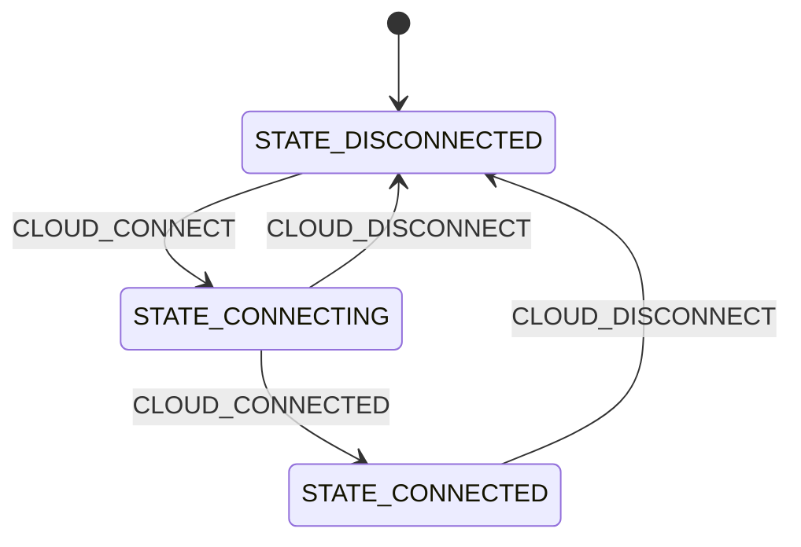

# Cloud module

The Cloud module owns the nRF Cloud connection. It runs the CoAP/DTLS session from the host MCU using the [nRF Cloud CoAP](https://docs.nordicsemi.com/bundle/ncs-latest/page/nrf/libraries/networking/nrf_cloud_coap.html) library, sends device messages, polls the device shadow, and resolves Wi-Fi based location requests. Cellular data passes through the Serial Modem over PPP, but the security session terminates on the host.

The module never decides on its own when to connect. It connects when the application requests it.

## Architecture

Connecting requires two things that are not available at boot: valid time, which is needed to sign the JWT used for CoAP authentication, and installed nRF Cloud credentials. The module therefore retries. Entering `STATE_CONNECTING` publishes `CLOUD_PRIV_CONNECT_ATTEMPT` on the [private channel](../architecture.md#private-channels) `priv_cloud_chan`, and an attempt that finds no credentials with `nrf_cloud_credentials_check()`, finds no valid time, or fails in `nrf_cloud_coap_connect()`, schedules the next attempt `CONFIG_APP_CLOUD_CREDENTIAL_RETRY_SECONDS` later. Time is requested over NTP, and the date/time handler publishes an attempt of its own as soon as time arrives instead of waiting out the interval. See the [main guide](../README.md) for how to install credentials and onboard the device.

Because an attempt is a single message, the module is back to waiting for messages between attempts, where it feeds its watchdog and answers `CLOUD_DISCONNECT` like any other request. What makes a single attempt long is the DTLS handshake in `nrf_cloud_coap_connect()`, which is why the module has a dedicated thread and a generous message processing budget.

The module posts pending [Memfault](../memfault.md) data over the same CoAP session when the application asks for it with `CLOUD_MEMFAULT_POST_REQUEST`.

### State diagram

The Cloud module implements a flat state machine with the following states and transitions:



### States

- **STATE_DISCONNECTED:** The initial state, in which there is no cloud connection. A `CLOUD_CONNECT` message starts connecting.
- **STATE_CONNECTING:** The module is attempting to connect, one attempt per `CLOUD_PRIV_CONNECT_ATTEMPT` message, until credentials and valid time are available. It publishes `CLOUD_CONNECTED` to itself on success, which is what moves the state machine on. Leaving the state cancels a scheduled retry.
- **STATE_CONNECTED:** The cloud connection is up, and the module serves device message, shadow poll, Memfault post, and location requests. Leaving this state closes the CoAP session with `nrf_cloud_coap_disconnect()`.

### Location ground fix

With the location overlay enabled, `cloud_location.c` handles `CLOUD_LOCATION_REQUEST` messages. It converts the scanned access points from the [Location module](location.md) into the format expected by nRF Cloud and calls `nrf_cloud_coap_location_get()`, which asks the nRF Cloud location service to resolve them into a position. The resolved position is logged together with a Google Maps URL. Requests with no access points, and positions the service cannot resolve, are logged and dropped.

## Messages

The Cloud module communicates on the `cloud_chan` channel, and uses `priv_cloud_chan` for the connect attempts it schedules for itself. The messages are defined in `cloud.h`.

### Input messages

- **CLOUD_CONNECT**: Request to establish the cloud connection.
- **CLOUD_DISCONNECT**: Request to tear down the cloud connection.
- **CLOUD_MESSAGE_SEND**: Request to send the device message in the `.payload` field as JSON.
- **CLOUD_SHADOW_POLL_REQUEST**: Request to poll the device shadow for a desired configuration.
- **CLOUD_MEMFAULT_POST_REQUEST**: Request to post any pending Memfault data.
- **CLOUD_LOCATION_REQUEST**: Request to resolve the Wi-Fi access points in the `.location_request` field into a position. Only available with the location overlay.

### Output messages

- **CLOUD_CONNECTED**: The cloud connection is established.
- **CLOUD_DISCONNECTED**: The cloud connection is down.
- **CLOUD_SHADOW_POLLED**: The device shadow has been polled.

### Message structure

```c
struct cloud_msg {
	enum cloud_msg_type type;
	char payload[CONFIG_APP_CLOUD_MSG_MAX_LEN];
	size_t payload_len;
#if defined(CONFIG_APP_LOCATION)
	/** Valid for @ref CLOUD_LOCATION_REQUEST messages. */
	struct location_cloud_request_data location_request;
#endif /* CONFIG_APP_LOCATION */
};
```

## Configurations

- **CONFIG_APP_CLOUD**: Enables the Cloud module. Enabled by default.

- **CONFIG_APP_CLOUD_THREAD_STACK_SIZE**: Sets the stack size for the cloud module thread. The default of 10240 accommodates the DTLS handshake.

- **CONFIG_APP_CLOUD_WATCHDOG_TIMEOUT_SECONDS**: Defines the timeout in seconds for the cloud module watchdog. This timeout covers both waiting for incoming messages and message processing time.

- **CONFIG_APP_CLOUD_MSG_PROCESSING_TIMEOUT_SECONDS**: Sets the maximum time allowed for processing a single message in the module's state machine. This value must be smaller than the watchdog timeout, and must leave room for a connect attempt, including the DTLS handshake.

- **CONFIG_APP_CLOUD_MSG_MAX_LEN**: Sets the maximum length of a device message payload, and thereby the size of `struct cloud_msg`.

- **CONFIG_APP_CLOUD_SHADOW_MAX_LEN**: Sets the buffer size used when polling the device shadow. A larger shadow is truncated and logged as a warning.

- **CONFIG_APP_CLOUD_CREDENTIAL_RETRY_SECONDS**: Sets the delay before the next connect attempt when credentials or valid time are missing, or when connecting fails.

- **CONFIG_APP_CLOUD_LOG_LEVEL_***: Controls the logging level for the cloud module. This follows Zephyr's standard logging configuration pattern.

The nRF Cloud security tag used for the DTLS credentials is set with `CONFIG_NRF_CLOUD_SEC_TAG`, and the device ID is derived from the host SoC hardware ID (`CONFIG_NRF_CLOUD_CLIENT_ID_SRC_HW_ID`).
