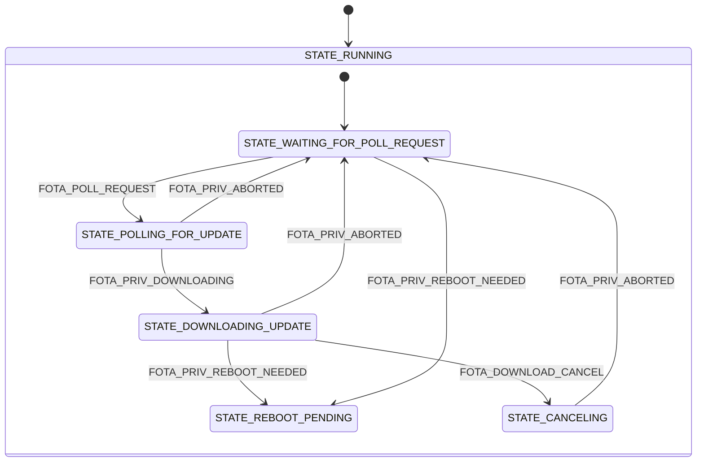

# FOTA module

The FOTA module updates the host application firmware over the air. On request it polls nRF Cloud for a firmware update job using the [nRF Cloud FOTA poll](https://docs.nordicsemi.com/bundle/ncs-latest/page/nrf/libraries/networking/nrf_cloud_fota_poll.html) library, downloads the image through the nRF Cloud CoAP proxy into the inactive MCUboot slot, and reports the job status back to the application.

The module does not reboot the device itself. When an update is ready to be applied it asks the application to reboot, so that the [Main module](main.md) can decide when it is safe to do so.

## Architecture

The nRF Cloud FOTA poll library reports progress through callbacks that run in the library's own context. The module forwards each callback as a message on its [private channel](../architecture.md#private-channels) `priv_fota_chan`, so all decisions are made in the state machine.

The module uses the library in its non-blocking mode: because it registers a status callback, `nrf_cloud_fota_poll_process()` starts the download and returns instead of blocking until the image has been downloaded. The call is made from the entry function of `STATE_POLLING_FOR_UPDATE`, and what it does synchronously is the poll itself: reliable CoAP requests to check for a job and report its status, plus a short wait inside the library after a job update. The download then runs on its own, and the substates that follow are entered from the messages the library's callbacks publish along the way. The watchdog timeout therefore only has to cover the blocking CoAP poll, not a whole download, and matches the Cloud module rather than dwarfing it.

On startup, the module confirms the running MCUboot image with `boot_write_img_confirmed()`. This marks a newly downloaded image as good, so MCUboot does not revert to the previous one on the next boot. It then publishes `FOTA_MODULE_READY`.

### State diagram

The FOTA module implements a hierarchical state machine with the following states and transitions:



### States

- **STATE_RUNNING:** Parent state entered on initialization. Its entry function initializes the FOTA poll library, confirms the running image, and publishes `FOTA_MODULE_READY`. It handles `FOTA_DOWNLOAD_CANCEL` on behalf of all substates that do not handle it themselves, which is how the cancel transition is reached from the downloading and reboot pending states.
    - **STATE_WAITING_FOR_POLL_REQUEST:** Default substate, in which the module is idle and waits for a `FOTA_POLL_REQUEST`. A cancel request is logged and ignored here, as there is nothing to cancel.
    - **STATE_POLLING_FOR_UPDATE:** The module asks nRF Cloud whether a job is available. If there is no job, it reports `FOTA_ABORTED` and returns to waiting. A cancel request is logged and ignored, since the download has not started.
    - **STATE_DOWNLOADING_UPDATE:** A download is in progress. The module publishes `FOTA_STARTING` on entry so the application knows not to interfere.
    - **STATE_REBOOT_PENDING:** The update is downloaded and the module publishes `FOTA_REBOOT_REQUEST`. The state machine stays here until the application reboots the device.
    - **STATE_CANCELING:** A cancel request was received. The module calls `fota_download_cancel()` and returns to waiting when the library confirms the abort.

## Messages

The FOTA module communicates on the `fota_chan` channel, and uses the private `priv_fota_chan` channel internally. The messages are defined in `fota.h`.

### Input messages

- **FOTA_POLL_REQUEST**: Request to poll nRF Cloud for any available firmware update.
- **FOTA_DOWNLOAD_CANCEL**: Request to cancel an ongoing FOTA download.

### Output messages

- **FOTA_MODULE_READY**: The FOTA module is initialized and ready to use.
- **FOTA_STARTING**: A FOTA download has started.
- **FOTA_REBOOT_REQUEST**: The module requires the application to reboot the device to continue or finalize the update.
- **FOTA_ABORTED**: The FOTA sequence ended without an update being applied, because the download failed, timed out, was canceled or rejected, or because no update was available.

### Message structure

```c
struct fota_msg {
	enum fota_msg_type type;
};
```

## Shell commands

The module registers the following commands when `CONFIG_APP_FOTA_SHELL` is enabled:

```shell
uart:~$ fota poll
uart:~$ fota cancel
```

## Configurations

- **CONFIG_APP_FOTA**: Enables the FOTA module. Enabled by default.

- **CONFIG_APP_FOTA_SHELL**: Enables the FOTA shell commands. Enabled by default when the shell is available.

- **CONFIG_APP_FOTA_THREAD_STACK_SIZE**: Sets the stack size for the FOTA module thread.

- **CONFIG_APP_FOTA_WATCHDOG_TIMEOUT_SECONDS**: Defines the timeout in seconds for the FOTA module watchdog. This timeout covers both waiting for incoming messages and message processing time. The download runs asynchronously and is not part of the processing time, so the timeout only has to cover the blocking CoAP poll that checks for and reports a job.

- **CONFIG_APP_FOTA_MSG_PROCESSING_TIMEOUT_SECONDS**: Sets the maximum time allowed for processing a single message in the module's state machine. This value must be smaller than the watchdog timeout.

- **CONFIG_APP_FOTA_LOG_LEVEL_***: Controls the logging level for the FOTA module. This follows Zephyr's standard logging configuration pattern.

The download needs a DTLS context of its own while the cloud session is connected, so `CONFIG_NET_SOCKETS_TLS_MAX_CONTEXTS` must be at least 2. See [Troubleshooting](../README.md#troubleshooting) if downloads fail to create a socket.
