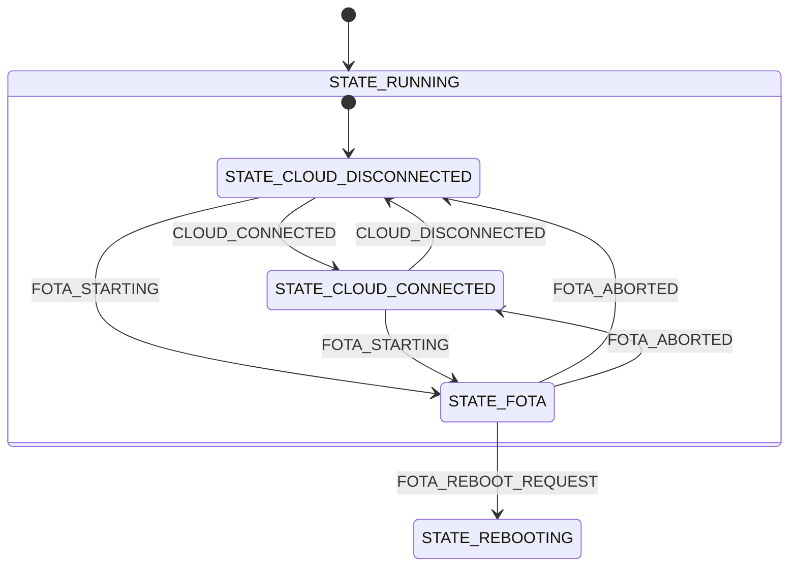

# Main module

The Main module implements the business logic of the application. It is the only module that knows about the others: it connects the cloud session to network availability, runs the periodic cloud synchronization, forwards location results to the cloud, and coordinates the reboot at the end of a firmware update.

Unlike the other modules, the Main module is not in the `modules` folder and does not run in a thread of its own. It runs in the `main()` thread, and it is the module that sets up the hardware watchdog that all other modules add their tasks to.

## Architecture

The module subscribes to the channels of all enabled modules, plus its own private channel:

| Channel | Purpose |
|---------|---------|
| `network_chan` | Connect or disconnect the cloud session as connectivity comes and goes |
| `cloud_chan` | Track the cloud connection state |
| `fota_chan` | Coordinate firmware updates and the reboot that applies them |
| `location_chan` | Forward Wi-Fi scan results to the Cloud module |
| `main_priv_chan` | Receive the periodic cloud synchronization trigger |

The periodic synchronization runs on a dedicated workqueue rather than in the state machine. The delayed work only publishes `MAIN_PRIV_CLOUD_SYNCHRONIZATION` on the [private channel](../architecture.md#private-channels) `main_priv_chan` and reschedules itself, so that the work never touches the state machine directly, and the synchronization itself is performed in the `main()` thread like every other event.

### State diagram

The Main module implements a hierarchical state machine with the following states and transitions:

### States

- **STATE_RUNNING:** Parent state entered on initialization. It handles the messages that are relevant in every state: network connectivity, which it answers with `CLOUD_CONNECT` or `CLOUD_DISCONNECT`, location results, which it forwards to the Cloud module, and `FOTA_STARTING`.
    - **STATE_CLOUD_DISCONNECTED:** Default substate, in which the cloud connection is down and synchronization triggers are ignored.
    - **STATE_CLOUD_CONNECTED:** The cloud connection is up. The entry function schedules the periodic synchronization and runs one immediately, and the exit function cancels it.
    - **STATE_FOTA:** A firmware download is in progress. Cloud synchronization is not scheduled in this state, so the download is not competing with device messages for the connection.
- **STATE_REBOOTING:** Terminal state entered when the FOTA module asks for a reboot. Its entry function flushes the logs and calls `sys_reboot()`.

### Cloud synchronization

While the cloud connection is up, the module performs a synchronization every `CONFIG_APP_MAIN_CLOUD_SYNCHRONIZATION_PERIOD_SECONDS`, and once immediately on connect. Each synchronization publishes the following requests in order:

1. `CLOUD_MESSAGE_SEND` with a demo JSON payload: `{"appId":"SMHA","messageType":"DATA","data":"hello"}`.
1. `LOCATION_SEARCH_TRIGGER`, when the application is built with the location overlay.
1. `CLOUD_SHADOW_POLL_REQUEST`, to pick up any desired configuration from the device shadow.
1. `FOTA_POLL_REQUEST`, when the FOTA module is enabled.
1. `CLOUD_MEMFAULT_POST_REQUEST`, to post any pending Memfault data. It goes last so that the Cloud module handles it once the requests above are done with the CoAP client.

The requests are only published, not awaited. Each module handles its request in its own thread, and results arrive later as messages.

### FOTA coordination

Because a firmware download and the reboot that follows must not be interrupted by the application, the module tracks the download separately from the cloud state:

- `FOTA_STARTING` moves the state machine to `STATE_FOTA` from anywhere under `STATE_RUNNING`, which stops the periodic synchronization.
- The cloud state at that point is remembered in `cloud_history`. A `CLOUD_DISCONNECTED` message received during the download updates `cloud_history` without leaving `STATE_FOTA`.
- `FOTA_ABORTED` restores the remembered cloud state, so the application resumes synchronizing if the connection is still up.
- `FOTA_REBOOT_REQUEST` moves the state machine to `STATE_REBOOTING`, which reboots the device to let MCUboot swap in the new image.

## Messages

The Main module defines the private channel `main_priv_chan` and publishes requests on the other modules' channels. It has no public channel and no output messages of its own.

## Configurations

- **CONFIG_APP_MAIN_CLOUD_SYNCHRONIZATION_PERIOD_SECONDS**: Sets the interval between cloud synchronizations while the cloud connection is up. The valid range is 5 to 3600 seconds.

- **CONFIG_APP_MAIN_CLOUD_SYNC_WORKQ_STACK_SIZE**: Sets the stack size for the cloud synchronization workqueue.

- **CONFIG_APP_MAIN_CLOUD_SYNC_WORKQ_PRIORITY**: Sets the thread priority of the cloud synchronization workqueue.

- **CONFIG_APP_MAIN_WATCHDOG_TIMEOUT_SECONDS**: Defines the timeout in seconds for the main watchdog. This timeout covers both waiting for incoming messages and message processing time.

- **CONFIG_APP_MAIN_MSG_PROCESSING_TIMEOUT_SECONDS**: Sets the maximum time allowed for processing a single message in the module's state machine. This value must be smaller than the watchdog timeout.

- **CONFIG_APP_MAIN_LOG_LEVEL_***: Controls the logging level for the main module. This follows Zephyr's standard logging configuration pattern.

The stack the state machine runs on is the main thread stack, set with `CONFIG_MAIN_STACK_SIZE`.
