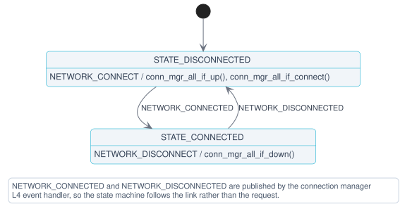

# Network module

The Network module owns the data connection to the nRF91M1 Serial Modem. It brings the PPP link up and down through Zephyr's [connection manager](https://docs.nordicsemi.com/bundle/ncs-latest/page/zephyr/connectivity/networking/conn_mgr/main.html) and reports connectivity to the rest of the application, so that no other module needs to know how the link is established.

By default the module connects on startup and keeps the connection for the lifetime of the application. The connection can also be controlled from the application or from the shell, see [Configurations](#configurations) and [Shell commands](#shell-commands).

## Architecture

The module reacts to `NET_EVENT_L4_CONNECTED` and `NET_EVENT_L4_DISCONNECTED` net management events, which are raised when the PPP link starts and stops carrying IP traffic. Because these events arrive in the net management context, the handler only publishes `NETWORK_CONNECTED` or `NETWORK_DISCONNECTED` on the module's own channel, and the state transition happens when the state machine receives that message. A `NET_EVENT_CONN_IF_FATAL_ERROR` event is treated as a fatal error.

### State diagram

The Network module implements a flat state machine with the following states and transitions. See [State diagram notation](../../../../doc/architecture.md#state-diagram-notation) for how to read it:



### States

- **STATE_DISCONNECTED:** The initial state, in which the device has no IP connectivity. A `NETWORK_CONNECT` message brings all network interfaces up and starts connecting (`conn_mgr_all_if_up()` and `conn_mgr_all_if_connect()`).
- **STATE_CONNECTED:** The PPP link carries IP traffic. A `NETWORK_DISCONNECT` message takes the interfaces down (`conn_mgr_all_if_down()`).

## Messages

The Network module communicates on the `network_chan` channel. The messages are defined in `network.h`.

### Input messages

- **NETWORK_CONNECT**: Request to connect to the network.
- **NETWORK_DISCONNECT**: Request to disconnect from the network.

### Output messages

- **NETWORK_CONNECTED**: The device is connected to the network and has IP connectivity.
- **NETWORK_DISCONNECTED**: The device is disconnected from the network.

### Message structure

```c
struct network_msg {
	enum network_msg_type type;
};
```

## Shell commands

The module registers the following commands when the shell is enabled:

```shell
uart:~$ network connect
uart:~$ network disconnect
```

## Configurations

- **CONFIG_APP_NETWORK**: Enables the Network module. Enabled by default.

- **CONFIG_APP_NETWORK_THREAD_STACK_SIZE**: Sets the stack size for the network module thread.

- **CONFIG_APP_NETWORK_WATCHDOG_TIMEOUT_SECONDS**: Defines the timeout in seconds for the network module watchdog. This timeout covers both waiting for incoming messages and message processing time.

- **CONFIG_APP_NETWORK_MSG_PROCESSING_TIMEOUT_SECONDS**: Sets the maximum time allowed for processing a single message in the module's state machine. This value must be smaller than the watchdog timeout.

- **CONFIG_APP_NETWORK_SEARCH_NETWORK_ON_STARTUP**: When enabled, the module publishes `NETWORK_CONNECT` to itself on startup. If disabled, connecting must be triggered by a `NETWORK_CONNECT` message from the application or the shell.

- **CONFIG_APP_NETWORK_LOG_LEVEL_***: Controls the logging level for the network module. This follows Zephyr's standard logging configuration pattern.
