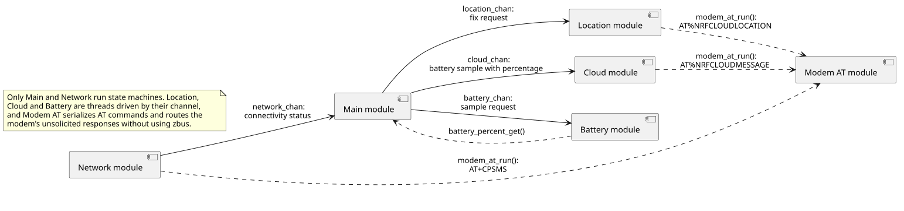
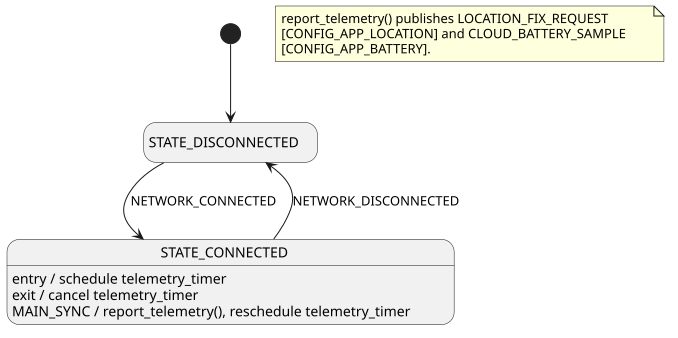
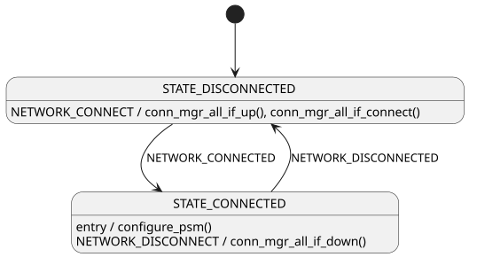

# State machines

The [93m1_at](../) application is built on a modular, event-driven architecture: modules communicate over [Zephyr bus (zbus)](https://docs.nordicsemi.com/bundle/ncs-latest/page/zephyr/services/zbus/index.html) channels, and the Main and Network modules process the resulting messages as events in a [State Machine Framework](https://docs.nordicsemi.com/bundle/ncs-latest/page/zephyr/services/smf/index.html) (SMF) state machine.

This document is the reference for those state machines. It is intended to describe the implementation exactly, so each diagram is generated from a PlantUML source in [`doc/diagrams/`](diagrams/) that is kept in step with the module's C file. See [State diagram notation](../../../doc/architecture.md#state-diagram-notation) for how to read the diagrams, and [Architecture](../../../doc/architecture.md) for the zbus and SMF patterns that all the applications share.

Both state machines here are small, because the modem is its own nRF Cloud client: the host does not terminate a cloud connection, so there is no connection lifecycle to model. What the host does instead is send AT commands, which is ordinary work rather than a state.

## Modules

The application consists of the following modules. Only Main and Network run state machines; Location, Cloud, and Battery are threads that act on the messages their channel delivers, and Modem AT has no channel at all.

The Modem AT module is the single point of contact with the modem. It serializes AT commands behind a mutex so the modules above it can issue commands without coordinating, and it routes the modem's unsolicited responses to whichever module subscribed to them. Location is how the modem reports a fix it resolved itself, and Cloud is how battery telemetry reaches nRF Cloud, both as AT commands rather than host-side IP traffic.

## Main module

The Main module runs in the `main()` thread. It tracks whether the modem has attached and, while it has, reports telemetry on a timer.

- **STATE_DISCONNECTED:** The initial state, entered with no cellular connectivity. Telemetry is not reported and the timer is not running.
- **STATE_CONNECTED:** The modem has attached. The entry function schedules the first telemetry report after `CONFIG_APP_SYNC_BOOT_DELAY_SECONDS`, each `MAIN_SYNC` tick reports telemetry and reschedules the timer `CONFIG_APP_SYNC_INTERVAL` ahead, and the exit function cancels it.

Reporting telemetry asks the Location module for a fix and sends the current battery percentage to the Cloud module. Both parts are compile-time optional, and the requests are only published; the modem reports the results in its own time.

## Network module

The Network module brings up the PPP link to the nRF93M1 Serial Modem through Zephyr's [connection manager](https://docs.nordicsemi.com/bundle/ncs-latest/page/zephyr/connectivity/networking/conn_mgr/main.html). The link exists only so the host can tell that the modem has attached to the network; no host IP traffic is exchanged over it. Net management events arrive in their own context, so the handler only publishes `NETWORK_CONNECTED` or `NETWORK_DISCONNECTED`, and the state machine transitions when it receives that message.

- **STATE_DISCONNECTED:** The initial state. A `NETWORK_CONNECT` request brings the interfaces up and starts connecting.
- **STATE_CONNECTED:** The modem has attached. The entry function configures power saving mode on the modem with `configure_psm()`, and a `NETWORK_DISCONNECT` request takes the interfaces down.
