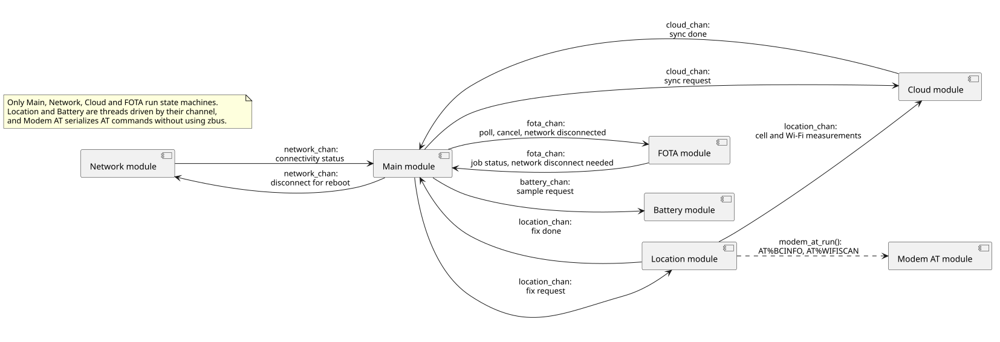
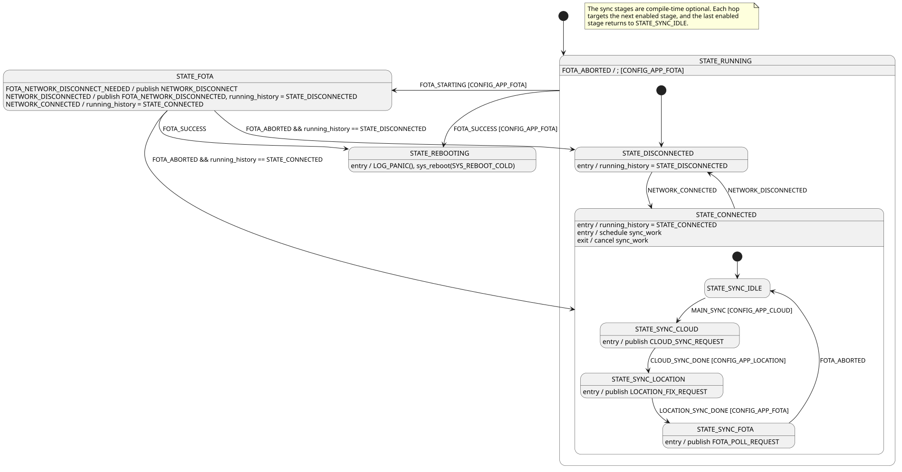
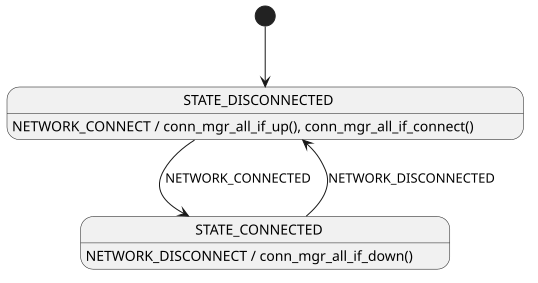
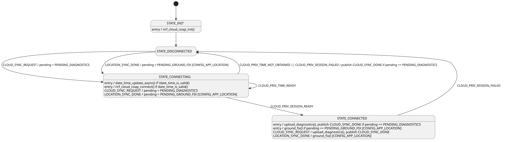
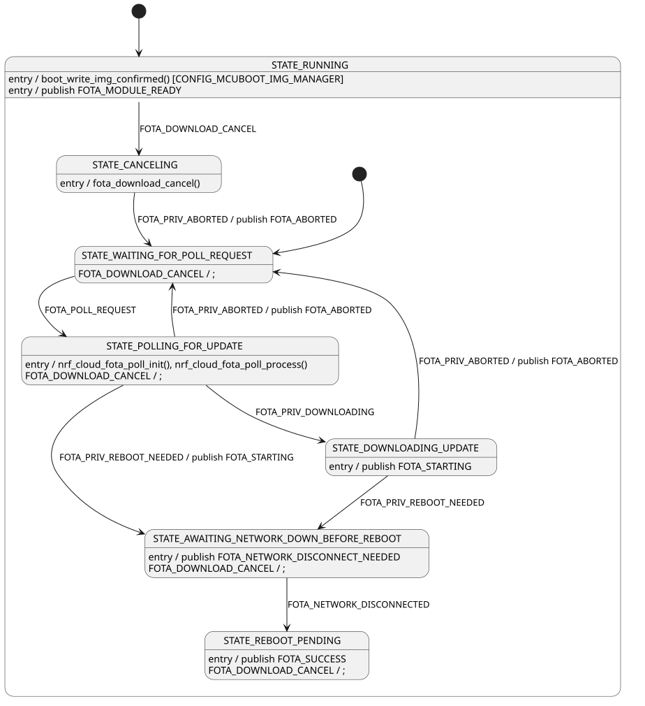

# State machines

The [93m1_ppp](../) application is built on a modular, event-driven architecture: modules communicate over [Zephyr bus (zbus)](https://docs.nordicsemi.com/bundle/ncs-latest/page/zephyr/services/zbus/index.html) channels, and most of them process the resulting messages as events in a [State Machine Framework](https://docs.nordicsemi.com/bundle/ncs-latest/page/zephyr/services/smf/index.html) (SMF) state machine.

This document is the reference for those state machines. It is intended to describe the implementation exactly, so each diagram is generated from a PlantUML source in [`doc/diagrams/`](diagrams/) that is kept in step with the module's C file. See [State diagram notation](../../../doc/architecture.md#state-diagram-notation) for how to read the diagrams, and [Architecture](../../../doc/architecture.md) for the zbus and SMF patterns that all the applications share.

## Modules

The application consists of the following modules. Main, Network, Cloud, and FOTA run state machines; Location and Battery are threads that act on the messages their channel delivers, and Modem AT has no channel at all and only serializes AT commands to the modem.

Not all traffic passes through the Main module: the Cloud module subscribes to `location_chan` directly, so a completed fix reaches it without the Main module forwarding it.

## Main module

The Main module drives the application from the `main()` thread. It waits for connectivity, then runs a periodic synchronization as a chain of substates, each of which asks one module to do its part and waits for the answer before moving on.

- **STATE_RUNNING:** Top-level state. It handles `FOTA_STARTING` and `FOTA_SUCCESS` on behalf of every substate, so a firmware update takes over the application from wherever it happens to be, and reports a `FOTA_ABORTED` that no substate consumed as "no update available".
    - **STATE_DISCONNECTED:** Default substate, entered with no cellular connectivity. Its entry function records the state in `running_history`.
    - **STATE_CONNECTED:** The modem has attached and the PPP link is up. The entry function schedules `sync_work` after `CONFIG_APP_MAIN_SYNC_BOOT_DELAY_SECONDS`, and the exit function cancels it.
        - **STATE_SYNC_IDLE:** Default substate, waiting for the next `MAIN_SYNC` tick from the synchronization work.
        - **STATE_SYNC_CLOUD:** Asks the Cloud module to upload diagnostics with `CLOUD_SYNC_REQUEST` and waits for `CLOUD_SYNC_DONE`.
        - **STATE_SYNC_LOCATION:** Asks the Location module for a fix with `LOCATION_FIX_REQUEST` and waits for `LOCATION_SYNC_DONE`.
        - **STATE_SYNC_FOTA:** Asks the FOTA module to poll with `FOTA_POLL_REQUEST`, and returns to idle when it reports `FOTA_ABORTED`, meaning no job was available.
- **STATE_FOTA:** A firmware update is in progress, so no synchronization is scheduled. The module relays the FOTA module's `FOTA_NETWORK_DISCONNECT_NEEDED` into a `NETWORK_DISCONNECT` request and reports the resulting `NETWORK_DISCONNECTED` back as `FOTA_NETWORK_DISCONNECTED`. Connectivity changes during the update only update `running_history`, which is the state restored if the update is abandoned.
- **STATE_REBOOTING:** Terminal state. Its entry function flushes the logs and calls `sys_reboot()` so MCUboot can swap in the new image.

The synchronization stages are compile-time optional. With the default configuration all three run in the order above; when one is disabled, its predecessor targets the next enabled stage instead, and the last enabled stage returns to `STATE_SYNC_IDLE`.

## Network module

The Network module owns the PPP link to the nRF93M1 Serial Modem through Zephyr's [connection manager](https://docs.nordicsemi.com/bundle/ncs-latest/page/zephyr/connectivity/networking/conn_mgr/main.html). Net management events arrive in their own context, so the handler only publishes `NETWORK_CONNECTED` or `NETWORK_DISCONNECTED`, and the state machine transitions when it receives that message.

- **STATE_DISCONNECTED:** The initial state, with no IP connectivity. A `NETWORK_CONNECT` request brings the interfaces up and starts connecting.
- **STATE_CONNECTED:** The PPP link carries IP traffic. A `NETWORK_DISCONNECT` request takes the interfaces down.

## Cloud module

The Cloud module holds the nRF Cloud CoAP/DTLS session from the host and uploads Memfault diagnostics and ground-fix requests over it. It does not keep the session up continuously: it connects when there is something to send and drops back to disconnected when the session fails.

- **STATE_INIT:** Entered on initialization. The entry function initializes the nRF Cloud CoAP client and immediately transitions on, which is why the transition out of it carries no event.
- **STATE_DISCONNECTED:** No CoAP session. A sync request or a completed location fix records what to send in `pending` and starts connecting.
- **STATE_CONNECTING:** The entry function signs a JWT and connects, but only once the date and time are known; without valid time it starts an asynchronous update instead and re-enters itself when `CLOUD_PRIV_TIME_READY` arrives. Work that arrives while connecting is remembered in `pending` rather than dropped. If time never arrives or the connect fails, a pending diagnostics upload still answers `CLOUD_SYNC_DONE`, because the Main module's synchronization chain is waiting on it.
- **STATE_CONNECTED:** The session is up. The entry function performs whatever was pending, and further requests are served directly. A failed request reports `CLOUD_PRIV_SESSION_FAILED`, which returns the module to disconnected.

## FOTA module

The FOTA module polls nRF Cloud for firmware update jobs with the [nRF Cloud FOTA poll](https://docs.nordicsemi.com/bundle/ncs-latest/page/nrf/libraries/networking/nrf_cloud_fota_poll.html) library and downloads them into the inactive MCUboot slot. The library reports progress through callbacks that run in its own context, so each callback is forwarded as a message on the private `priv_fota_chan` channel and all decisions are made in the state machine.

- **STATE_RUNNING:** Parent state entered on initialization. Its entry function confirms the running image so MCUboot does not revert it, and publishes `FOTA_MODULE_READY`. It handles `FOTA_DOWNLOAD_CANCEL` for every substate that does not consume it itself.
    - **STATE_WAITING_FOR_POLL_REQUEST:** Default substate, idle until a `FOTA_POLL_REQUEST` arrives. A cancel request is logged and ignored, as there is nothing to cancel.
    - **STATE_POLLING_FOR_UPDATE:** Asks nRF Cloud whether a job is available. A job staged before this boot needs no download and goes straight to waiting for the network to go down; no job at all reports `FOTA_ABORTED`.
    - **STATE_DOWNLOADING_UPDATE:** A download is in progress. The module publishes `FOTA_STARTING` on entry so the application stops competing for the connection.
    - **STATE_AWAITING_NETWORK_DOWN_BEFORE_REBOOT:** The image is staged. The module asks for the network to be taken down with `FOTA_NETWORK_DISCONNECT_NEEDED` and waits for the application to confirm with `FOTA_NETWORK_DISCONNECTED`.
    - **STATE_REBOOT_PENDING:** The module publishes `FOTA_SUCCESS` and stays here until the application reboots the device.
    - **STATE_CANCELING:** A cancel request was received. The module calls `fota_download_cancel()` and returns to waiting when the library confirms the abort.

Once the update is staged it is too late to cancel, so `FOTA_DOWNLOAD_CANCEL` is consumed and logged in the two states that follow the download.
