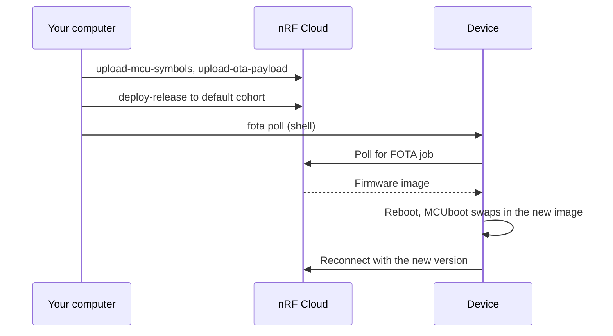

# Application FOTA

This page describes how to update the host application firmware over the air (FOTA) on the PPP host applications ([nRF91M1 PPP](applications/91m1_ppp/README.md) and [nRF93M1 PPP](applications/93m1_ppp/README.md)) from the command line. You publish the update with the [Memfault CLI](https://docs.memfault.com/docs/ci/install-memfault-cli), and the device fetches it from nRF Cloud over its existing CoAP session. The same steps run in CI in [`test_application_fota.py`](https://github.com/nrfconnect/ncs-serial-modem-host-applications/blob/main/tests/on_target/tests/test_fota/test_application_fota.py).



## Prerequisites

To follow this guide, you must meet the following requirements:

- A device that is provisioned, onboarded to nRF Cloud, and logs `Cloud connected`. See the setup guide for [nRF91M1 PPP](applications/91m1_ppp/README.md) or [nRF93M1 PPP](applications/93m1_ppp/README.md).
- The Memfault CLI: `pip3 install memfault-cli`.
- An organization auth token and the organization and project slugs. Open **Memfault** from the nRF Cloud sidebar (see [Memfault remote debugging](applications/91m1_ppp/memfault.md)), then go to **Admin** > **Organization Auth Tokens**. The slugs are part of the project URL.

> [!NOTE]
> Devices are assigned to the `default` cohort when they first connect, and this guide deploys the release there. A release deployed to `default` is offered to every device in the project with the same hardware version and software type that runs an older version.

## Release parameters

The CLI needs the following values for the build:

| Application | Board | `--software-type` | `--hardware-version` |
|-------------|-------|-------------------|----------------------|
| `91m1_ppp` | `nrf54l15dk/nrf54l15/cpuapp/ns` | `smha-91m1` | `nrf54l15dk` |
| `91m1_ppp` | `nrf54lm20dk/nrf54lm20b/cpuapp/ns` | `smha-91m1` | `smha-nrf54lm20dk` |
| `93m1_ppp` | `nrf93m1dk/nrf54l15/cpuapp/ns` | `smha-93m1` | `smha-nrf93m1dk` |

`--software-version` is the version the update image reports. It comes from the application's [`VERSION`](https://github.com/nrfconnect/ncs-serial-modem-host-applications/blob/main/applications/93m1_ppp/VERSION) file, in the format `MAJOR.MINOR.PATCH+TWEAK`. For example, `1.0.1+0`. The update must have a higher version than the firmware running on the device. To read the exact value from a build, run the following command:

```shell
grep CONFIG_MEMFAULT_NCS_FW_VERSION= build/<app>/zephyr/.config
```

## Steps

The examples use `93m1_ppp` on the nRF93M1 DK, updating from `1.0.0` to `1.0.1`. For `91m1_ppp`, change the application, board, and parameters from the table above.

### 1. Build the update image

Starting from the firmware that runs on the device, bump the version in `applications/93m1_ppp/VERSION`:

```text
VERSION_MAJOR = 1
VERSION_MINOR = 0
PATCHLEVEL = 1
VERSION_TWEAK = 0
EXTRAVERSION =
```

Then build it. Do not flash this image.

```shell
cd applications/93m1_ppp
west build -p -b nrf93m1dk/nrf54l15/cpuapp/ns
```

The build produces the following files:

- `build/93m1_ppp/zephyr/zephyr.signed.bin` - The signed MCUboot image, which is the OTA payload.
- `build/93m1_ppp/zephyr/zephyr.elf` - The symbol file, used to decode crash reports from the new image.

### 2. Publish and deploy the release

Set the credentials from the [prerequisites](#prerequisites) as environment variables:

```shell
export MEMFAULT_ORG_TOKEN=<org_auth_token>
export MEMFAULT_ORG=<org_slug>
export MEMFAULT_PROJECT=<project_slug>
```

Upload the symbol file:

```shell
memfault --org-token $MEMFAULT_ORG_TOKEN --org $MEMFAULT_ORG --project $MEMFAULT_PROJECT \
    upload-mcu-symbols build/93m1_ppp/zephyr/zephyr.elf
```

Upload the OTA payload, which creates release `1.0.1+0`:

```shell
memfault --org-token $MEMFAULT_ORG_TOKEN --org $MEMFAULT_ORG --project $MEMFAULT_PROJECT \
    upload-ota-payload \
    --hardware-version smha-nrf93m1dk \
    --software-type smha-93m1 \
    --software-version 1.0.1+0 \
    build/93m1_ppp/zephyr/zephyr.signed.bin
```

Deploy the release to the `default` cohort:

```shell
memfault --org-token $MEMFAULT_ORG_TOKEN --org $MEMFAULT_ORG --project $MEMFAULT_PROJECT \
    deploy-release --release-version 1.0.1+0 --cohort default
```

To update only part of the cohort, add `--rollout-percent` to `deploy-release`. See the [`deploy-release`](https://docs.memfault.com/docs/ci/cli/deploy-release) reference for more information.

### 3. Trigger the update

The device checks for updates on its own once per cloud sync interval. To start the update right away, run the following command in the host shell:

```shell
uart:~$ fota poll
```

The following log shows that the download has started:

```text
<inf> main: FOTA download starting
```

nRF Cloud can take up to a minute to offer a newly deployed release. If the poll finds no update (`93m1_ppp` logs `No FOTA update available`), wait a little and run `fota poll` again.

### 4. Wait for the device to reboot

A download of about 540 KiB over cellular takes four to five minutes. When it completes, the device logs the following and reboots:

```text
<inf> main: FOTA successful, rebooting to apply the update
```

MCUboot swaps in the new image. The device then reconnects (`Cloud connected`) and confirms the image, so MCUboot keeps it on later boots.

### 5. Verify the version

Run the following command in the host shell:

```shell
uart:~$ mflt get_device_info
```

The software version must be `1.0.1+0`. The device also shows the new version in nRF Cloud after its next upload.

### 6. Deactivate the release when testing

While a release is deployed, it is offered to every device in the cohort that runs an older version. When you test repeatedly and reflash older firmware, deactivate the release afterward so the device does not update again:

```shell
memfault --org-token $MEMFAULT_ORG_TOKEN --org $MEMFAULT_ORG --project $MEMFAULT_PROJECT \
    deploy-release --release-version 1.0.1+0 --cohort default --deactivate
```

## Run the CI test locally

The CI test automates the steps above. It builds the update, publishes and deploys it, runs `fota poll`, checks the new version, and cleans up the release. To run it against your own DK, point the hardware and cloud variables in [`.github/test/tests.yml`](https://github.com/nrfconnect/ncs-serial-modem-host-applications/blob/main/.github/test/tests.yml) at your board, then run the following commands:

```shell
export TEST_JSON="$(PYTHONPATH=tests/on_target python3 -m ci.catalog load 93m1_ppp-application-fota-nrf93m1)"
PYTHONPATH=tests/on_target pytest tests/on_target/tests/test_fota/ -c tests/on_target/tests/pytest.ini -v
```

See [CI and contribution](ci-and-contribution.md) for the required environment variables.

## Troubleshooting

| Symptom | Fix |
|---------|-----|
| `upload-ota-payload` is rejected for the hardware version | The hardware version is bound to another software type in the project. Use the `--hardware-version` value from the [Release parameters](#release-parameters) table, which matches what the build reports. |
| `fota poll` never finds the update | Check that the release is deployed to the `default` cohort, the device has not been moved to another cohort, and its version is higher than the version running on the device. |
| The device updates again after reflashing old firmware | The release is still deployed. Deactivate it (step 6). |
| The download fails to create a socket | `CONFIG_NET_SOCKETS_TLS_MAX_CONTEXTS` must be at least 2. See the [FOTA module](applications/91m1_ppp/modules/fota.md) configuration. |
