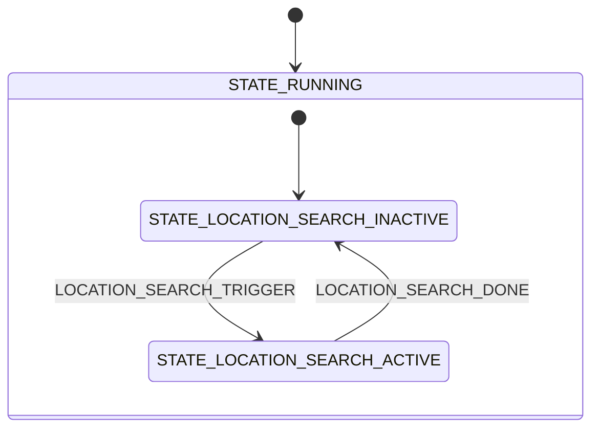

# Location module

The Location module finds the device position from nearby Wi-Fi access points. On request it runs a Wi-Fi scan through the [Location](https://docs.nordicsemi.com/bundle/ncs-latest/page/nrf/libraries/modem/location.html) library and publishes the scan result for the application to resolve into a position.

The module is only built with the location overlay, which requires an nRF7002-EB2 shield for Wi-Fi scanning. See [Hardware setup](../hardware-setup.md#nrf54lm20b-dk-with-nrf7002-eb2-for-wi-fi-location) for wiring and build commands.

## Architecture

The Location library is configured to use an external cloud service for positioning, so the module never resolves a position itself. When a scan completes, the library asks for the scan data to be resolved externally, and the module publishes the access points as a `LOCATION_CLOUD_REQUEST` message. The [Main module](main.md) forwards that message to the [Cloud module](cloud.md), which performs the nRF Cloud ground fix request and logs the resulting position. This split keeps the module independent of which cloud the application uses.

Finding access points is treated as a successful search, regardless of whether the cloud can resolve them. The module therefore cancels the ongoing request as soon as the scan data has been published, which stops the Location library from falling back to another positioning method.

A search trigger that arrives while a search is already active is ignored, so a scan that takes longer than the application's synchronization period simply results in fewer position updates.

> [!NOTE]
> `CONFIG_LOCATION_DATA_DETAILS` cannot be enabled in this application, because it makes `<modem/location.h>` include nRF Modem GNSS headers that only exist when the nRF Modem Library is built, and the modem is external on the host. As a result, the Location library never emits `LOCATION_EVT_CANCELLED`, and the module completes a canceled search from its own context instead.

### State diagram

The Location module implements a hierarchical state machine with the following states and transitions:



### States

- **STATE_RUNNING:** Parent state entered on initialization. Its entry function initializes the Location library and publishes `LOCATION_MODULE_READY`.
    - **STATE_LOCATION_SEARCH_INACTIVE:** Default substate, in which no search is running. A `LOCATION_SEARCH_TRIGGER` starts a search with `location_request()`.
    - **STATE_LOCATION_SEARCH_ACTIVE:** A Wi-Fi scan is running. Further triggers are ignored. A `LOCATION_SEARCH_CANCEL` cancels the request and completes the search by publishing `LOCATION_SEARCH_DONE`.

Search results arrive asynchronously from the Location library. Location found, timeout, error, and unknown result all lead to `LOCATION_SEARCH_DONE`, which returns the module to the inactive state.

## Messages

The Location module communicates on the `location_chan` channel. The messages are defined in `location.h`.

### Input messages

- **LOCATION_SEARCH_TRIGGER**: Request to start a location search, which starts a Wi-Fi scan and publishes the result as `LOCATION_CLOUD_REQUEST`.
- **LOCATION_SEARCH_CANCEL**: Request to cancel an ongoing location search. Wi-Fi scans cannot be truly canceled at the driver level, so a canceled scan may keep running and cause `-EBUSY` on the next request. Use this only when necessary.

### Output messages

- **LOCATION_MODULE_READY**: The Location module is initialized and ready to use.
- **LOCATION_SEARCH_STARTED**: A location search has been initiated and is now active.
- **LOCATION_SEARCH_DONE**: A location search has completed, successfully or because of a timeout or error. The module is ready to accept a new search.
- **LOCATION_CLOUD_REQUEST**: Wi-Fi scan data is available for resolution by a cloud positioning service. The access points are in the `.cloud_request` field of the message.

### Message structure

```c
/** Wi-Fi access point information. */
struct location_wifi_ap_info {
	int8_t rssi;
	uint8_t mac[MAC_ADDR_LEN];
	uint8_t mac_length;
};

/** Cloud location request data containing Wi-Fi scanning information. */
struct location_cloud_request_data {
	uint16_t wifi_cnt;
	struct location_wifi_ap_info wifi_aps[CONFIG_APP_LOCATION_WIFI_APS_MAX];
};

struct location_msg {
	enum location_msg_type type;

	/** Contains cloud location request data with Wi-Fi information.
	 *  cloud_request is valid for LOCATION_CLOUD_REQUEST messages.
	 */
	struct location_cloud_request_data cloud_request;
};
```

## Configurations

- **CONFIG_APP_LOCATION**: Enables the Location module. Enabled by default when the Location library is enabled, which the location overlay does.

- **CONFIG_APP_LOCATION_THREAD_STACK_SIZE**: Sets the stack size for the location module thread.

- **CONFIG_APP_LOCATION_WATCHDOG_TIMEOUT_SECONDS**: Defines the timeout in seconds for the location module watchdog. This timeout covers both waiting for incoming messages and message processing time.

- **CONFIG_APP_LOCATION_MSG_PROCESSING_TIMEOUT_SECONDS**: Sets the maximum time allowed for processing a single message in the module's state machine. This value must be smaller than the watchdog timeout.

- **CONFIG_APP_LOCATION_WIFI_APS_MAX**: Sets the maximum number of Wi-Fi access points stored in a location request, and thereby the size of `struct location_msg`. It must be at least `CONFIG_LOCATION_METHOD_WIFI_SCANNING_RESULTS_MAX_CNT`.

- **CONFIG_APP_LOCATION_LOG_LEVEL_***: Controls the logging level for the location module. This follows Zephyr's standard logging configuration pattern.
